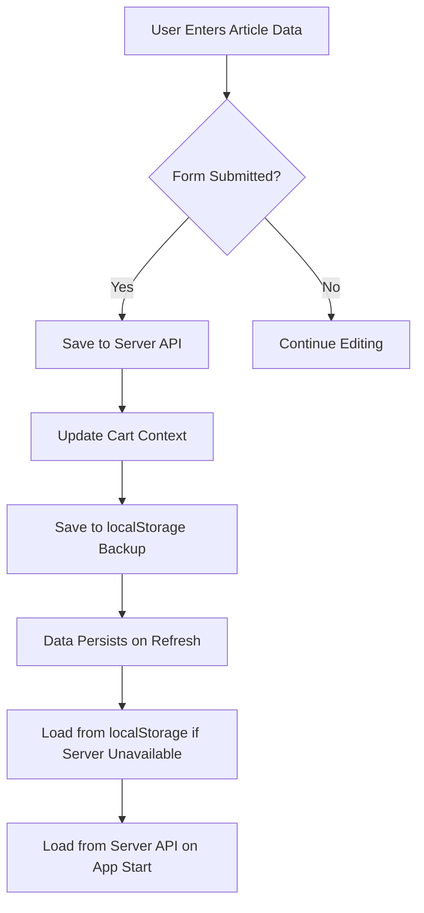

# Data Persistence Implementation

## Overview
This document explains how data persistence is implemented in the application to ensure that user data is always saved to the database and persists even after page refreshes.

## Implementation Details

### 1. Cart Context Enhancements
The CartContext has been enhanced with the following features:

1. **Server Loading**: Cart data is loaded from the server when the application starts
2. **Automatic Saving**: Cart data is automatically saved to the server whenever it changes
3. **Fallback Mechanism**: If server saving fails, data is saved to localStorage as a backup
4. **Debouncing**: Save operations are debounced to prevent excessive server requests
5. **Article Data Saving**: Added functionality to save article data to the server

### 2. Article Data Persistence
Article data created by advertisers is persisted in the following way:

1. **Immediate Saving**: When an advertiser submits their article, it's immediately saved to the server
2. **Cart Integration**: Article data is also stored in the cart context for immediate access
3. **Server Synchronization**: The cart context synchronizes with the server to ensure consistency
4. **API Integration**: Uses dedicated API endpoints for saving and retrieving article data

### 3. Data Flow

### 4. Key Components

#### CartContext.jsx
- Implements server loading and saving
- Provides fallback to localStorage
- Manages cart state with persistence
- Includes `saveArticleData` function for saving article data to server

#### ChooseMyOwnArticle.jsx
- Saves article data to server on submission using cart context function
- Loads existing article data from server or cart
- Handles both view and edit modes

#### ShoppingCart.jsx
- Displays article status and options
- Provides View/Edit buttons for existing articles
- Integrates with cart context for data management

#### API Services (api.js)
- Added new endpoints for article data:
  - `saveArticleData(orderId, articleData)` - POST `/orders/:orderId/article`
  - `getArticleData(orderId)` - GET `/orders/:orderId/article`

## Benefits

1. **Data Safety**: User data is never lost, even if the server is temporarily unavailable
2. **Performance**: Debouncing prevents excessive server requests
3. **Consistency**: Data is synchronized between client and server
4. **User Experience**: Users can refresh the page without losing their work
5. **Scalability**: Dedicated endpoints for article data management

## Future Enhancements

1. **Real Server Integration**: Replace localStorage fallback with actual server API calls
2. **Conflict Resolution**: Handle cases where local and server data differ
3. **Offline Support**: Enhance offline capabilities with better local caching
4. **Data Validation**: Add comprehensive validation for article data on both client and server
5. **Error Handling**: Improve error handling and user feedback for data saving operations

## Backend Implementation

See [Article Data API Endpoints](../../collabsworld/docs/article-data-endpoints.md) for detailed backend implementation requirements.